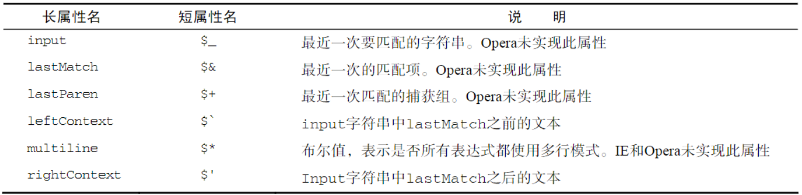

# 引用类型

## object类型

### 创建object实例

#### new Object()

```javascript
var l = new Object();
l.a = "aba";
l.b = 123;
```

#### 对象字面量

该方法下 属性名可以使用字符串或者数值

```javascript
var l = {
  "a":"aba",
  b:123
};
```

### 访问对象属性

#### 点表示法 .

##### 通用方法，只能用点表示法访问对象方法

#### 方括号法 []

##### 可以访问属性名中包含空格或者使用关键字和保留字作为属性名的情况

## Array类型

### 创建Array

#### 使用Array构造函数 new Array()

注意 new操作符可以省略

```javascript
let a = new Array(3);
let b = Array(5);
```

#### 使用数组字面量

```javascript
let c = []
```

### length属性

#### 该属性不是只读的

```javascript
let a = new Array(3);
a[4]=6 // [,,,,6]
```

### 检测数组

#### 全局环境 value instanceof Array

#### 通用 Array.isArray(value)

### 转换方法

```javascript
let a = ["aaa","bbb","ccc"];
a.toString() // "aaa,bbb,ccc"
a.toLocaleString()	// "aaa,bbb,ccc"
a.valueOf() //["aaa","bbb","ccc"]
```

#### toString()

##### 返回字符串

#### toLocaleString()

特殊情况

```javascript
var person1 = { 
toLocaleString : function () {
return "Nikolaos";     
},     
toString : function() { 
return "Nicholas";     
} 
}; 
var person2 = { 
toLocaleString : function () {
return "Grigorios";     
},     
toString : function() { 
return "Greg";     
} 
}; 
var people = [person1, person2]; 
alert(people);                          //Nicholas,Greg 
alert(people.toString());               //Nicholas,Greg 
alert(people.toLocaleString());         //Nikolaos,Grigorios
```

##### 返回逗号间隔的字符串

#### valueOf()

##### 返回一个数组

#### join()

##### 返回一个字符串，join参数为分隔符

### 栈方法

栈数据结构的访问规则是LIFO（后进先出）也就是最新添加的项最早被移除.

#### push()

将元素推到数组尾部，长度+1

#### pop()

移除尾部元素，数组长度减一

### 队列方法

而队列数据结构的访问规则是FIFO（First-In-First-Out，先进先出）。

队列在列表的末端添加项，从列表的前端移除项

使用 push() shift()或 pop() unshift() 模拟队列

#### shift()

移除头部元素，并返回该元素

#### unshift()

头部添加元素，长度+1

### 重排序方法

#### 反转数组 reverse()

反转数组

#### 排序 sort()

对数组进行排序，可以传入函数做参数

### 操作方法

#### 拼接concat()

该方法会先对当前数组做一个深拷贝，然后将接受的参数添加到尾部，并返回新数组

#### 数组切片slice() 不改变原数组

slice(0,n);
得到的是[0,n-1]

#### splice() 改变原数组

1、数组剪切
splice(0,2),从0开始删除2项
2、数组插入
splice(0,0,"a","v")，在开头插入两项"a","v"
3、替换
splice(1,1,"a"),将第二项替换位"a"

### 位置方法

#### indexOf()

从数组的开头（位置0）开始向后查找

#### lastIndexOf()

从数组的末尾开始向前查找。

### 迭代方法

every()：对数组中的每一项运行给定函数，如果该函数对每一项都返回true，则返回true。

filter()：对数组中的每一项运行给定函数，返回该函数会返回true的项组成的数组。

forEach()：对数组中的每一项运行给定函数。这个方法没有返回值。

map()：对数组中的每一项运行给定函数，返回每次函数调用的结果组成的数组。

some()：对数组中的每一项运行给定函数，如果该函数对任一项返回true，则返回true。

#### every()

对数组中的每一项运行给定函数，如果该函数对每一项都返回true，则返回true。

#### filter()

对数组中的每一项运行给定函数，返回该函数会返回true的项组成的数组。

#### forEach()

对每一项运行给定函数，无返回值

#### map()

对每一项运行给定函数，返回运行结果

#### some()

每一项运行函数，有一项为true即返回true

### 归并方法

#### 合并reduce()

迭代数组的所有项，然后构建一个最终返回的值。

接收4个参数：前一个值、当前值、项的索引和数组对象

```javascript
var values = [1,2,3,4,5]; 
var sum = values.reduce(
  function(prev, cur, index, array){     
    return prev + cur;  
  });	\\ 15
```

#### 从尾部合并reduceRight()

从数组尾部迭代数组的所有项，然后构建一个最终返回的值。

接收4个参数：前一个值、当前值、项的索引和数组对象


## Date类型

### 创建新的实例

#### 使用构造函数 new Date()

##### typeof结果为object

#### 省略 new

##### typeof结果为String

### 基础方法

#### Date.parse()

如果直接使用Date只要传入参数会自动调用parse

接收一个表示日期的字符串参数，然后尝试根据这个字符串返回相应日期的毫秒数。

```javascript
var someDate = new Date(Date.parse("May 25, 2004"));
//等价于	new Date("May 25, 2004");
//Tue May 25 2004 00:00:00 GMT+0800 (中国标准时间)
```

#### Date.UTC()

Date.UTC()的参数分别是年份、基于0的月份（一月是0，二月是1，以此类推）、月中的哪一天（1到31）、小时数（0到23）、分钟、秒以及毫秒数。在这些参数中，只有前两个参数（年和月）是必需的。如果没有提供月中的天数，则假设天数为1；如果省略其他参数，则统统假设为0。

```javascript
var y2k = new Date(Date.UTC(2000, 0));
// 等价于	new Date(2000, 0);
// Sat Jan 01 2000 08:00:00 GMT+0800 (中国标准时间)
```

#### Date.now()

返回表示调用这个方法时的日期和时间的毫秒数。

可以用来计时

```javascript
//取得开始时间
var start = Date.now();
//调用函数
doSomething(); 
//取得停止时间
var stop = Date.now(),
result = stop – start;
```

在不支持它的浏览器中，使用+操作符把Data对象转换成字符串，也可以达到同样的目的。

### 继承的方法

#### toString()
toLocaleString()

##### 不同浏览器输出格式不同

#### valueOf()

##### 输出为日期的毫秒表示，因此可以用</>比较日期值

### 格式化方法

toDateString()——以特定于实现的格式显示星期几、月、日和年；

toTimeString()——以特定于实现的格式显示时、分、秒和时区；

toLocaleDateString()——以特定于地区的格式显示星期几、月、日和年；

toLocaleTimeString()——以特定于实现的格式显示时、分、秒；

toUTCString()——以特定于实现的格式完整的UTC日期。

### 日期/时间组件方法

getTime()		返回表示日期的毫秒数；与valueOf()方法返回的值相同

setTime(毫秒)		以毫秒数设置日期，会改变整个日期

getFullYear，
getMonth，
getDate，获取星期几。
getDay，
getHours

## RegExp类型

### 新建正则匹配式

#### var expression = / pattern / flags ;

```javascript
var expression = / pattern / flags ;
```

##### flag标志

###### g全局

###### i 不区分大小写

###### m多行模式

#### 元字符

( [ { \ ^ $ | ) ? * + .]}

##### 元字符需要转义：/\[at\]/

```javascript
/* 匹配第一个" [bc]at"，不区分大小写*/ 
var pattern2 = /\[bc\]at/i; 
/* 匹配所有以"at"结尾的3个字符的组合，不区分大小写*/ 
var pattern3 = /.at/gi; 
/* 匹配所有".at"，不区分大小写*/
var pattern4 = /\.at/gi;
```

#### 使用regExp构造函数

```javascript
/* 与pattern1相同，只不过是使用构造函数创建的*/ 
var pattern2 = new RegExp("[bc]at", "i");
```

### RegExp实例属性

global：布尔值，表示是否设置了g标志。
ignoreCase：布尔值，表示是否设置了i标志。
lastIndex：整数，表示开始搜索下一个匹配项的字符位置，从0算起。
multiline：布尔值，表示是否设置了m标志。
source：正则表达式的字符串表示，按照字面量形式而非传入构造函数中的字符串模式返回。

### RegExp实例方法

#### exec()

exec() 方法用于检索字符串中的正则表达式的匹配。

返回一个数组，其中存放匹配的结果。如果未找到匹配，则返回值为 null。

### RegExp构造函数属性



## Function类型

### 没有重载

可以手动实现重载

一种是通过switch判断参数长度

第二种是[通过闭包的思想](https://juejin.im/post/5b4465516fb9a04fe017f926)

### 函数内部属性

#### arguments

是一个类数组对象，包含着传入函数中的所有参数

#### this

this引用的是函数执行的环境对象

### 函数属性和方法

#### length

参数数量

#### prototype

保存函数的所有实例方法，类似tostring、valueof等

#### call改变this

在特定的作用域中调用函数，实际上等于设置函数体内this对象的值

call()方法接收多个参数：一个是在其中运行函数的作用域，剩下都是会直接传给函数的参数。

```javascript
function callSum(num1, num2){
  return sum.call(this, num1, num2);
} 
alert(callSum(10,10));   //20
```

#### apply改变this

在特定的作用域中调用函数，实际上等于设置函数体内this对象的值。

apply()方法接收两个参数：一个是在其中运行函数的作用域，另一个是参数数组。

```javascript
function callSum1(num1, num2){  
  return sum.apply(this, arguments);
// 传入arguments对象
} 
function callSum2(num1, num2){
  return sum.apply(this, [num1, num2]);
// 传入数组
}
alert(callSum1(10,10));   //20
alert(callSum2(10,10));   //20
```

**这两者最大的用处是扩充函数的作用域**

#### bind()

这个方法会创建一个函数的实例，其this值会被绑定到传给bind()函数的值。

```javascript
window.color = "red"; 
var o = { color: "blue" }; 
function sayColor(){
  alert(this.color); 
}  
var objectSayColor = sayColor.bind(o); 
objectSayColor();    //blue
```

## 基本包装类型

这些类型与本章介绍的其他引用类型相似，但同时也具有与各自的基本类型相应的特殊行为。

实际上，每当读取一个基本类型值的时候，后台就会创建一个对应的基本包装类型的对象，从而让我们能够调用一些方法来操作这些数据。

### String

#### substr(index,length)

第一个负数加上字符串长度，第二个负数转为0

#### substring(start,end)

[start,end)

所有负数参数转为0

##### [start,end)

#### slice(start,end)

同数组的slice

负数从尾部向前数，即将其加上字符串长度处理

[start,end)

#### charAt(index)

返回指定位置的字符

#### charCodeAt(index)

返回指定位置的字符编码

#### concat()

可以接受多个参数，拼接多个字符串

#### indexOf(str,startindex)

#### lastIndexOf(str,endindex)

#### trim()

返回字符串副本并删除所有前置后缀空格

#### match(RegExp)

功能同于

reg.exec(str)

#### search(regexp)

始终从头向后查询

#### replace(regexp,str)

```javascript
var text = "cat, bat, sat, fat";
var result = text.replace("/at/g", "ond"); 
alert(result); //"cond, bond, sond, fond" 
```

#### split()

#### localeCompare()

```javascript
var stringValue = "yellow"; 
alert(stringValue.localeCompare("brick"));       //1 
alert(stringValue.localeCompare("yellow"));      //0 
alert(stringValue.localeCompare("zoo"));         //-1
```

### Boolean

var booleanObject = new Boolean(true); 

尽量别用 这个的类型是对象

### Number

#### toFixed(小数点位数)

```javascript
var num = 10;
alert(num.toFixed(2));     //"10.00"
num = 10.006;
alert(num.toFixed(2));     //"10.01"
```

#### toExponential()

返回以指数表示法（也称e表示法）表示的数值的字符串形式。

```javascript
num = 10;
alert(num.toExponential(1));   //"1.0e+1" 
```

## 单体内置对象

### Global对象

* encodeURI()
* encodeURIComponent()

两个URI编码方法就可以对URI进行编码，它们用特殊的UTF-8编码替换所有无效的字符，从而让浏览器能够接受和理解。

* decodeURI()
* decodeURIComponent()

对使用encodeURI()和encodeURIComponent替换的字符进行解码。

#### eval()

接受参数为js代码字符串，可以进行js解析并执行

### Math对象

* Math.min()
* Math.max()
* Math.ceil()向上取整
* Math.floor()向下取整
* Math.round()四舍五入
* Math.random()随机数
